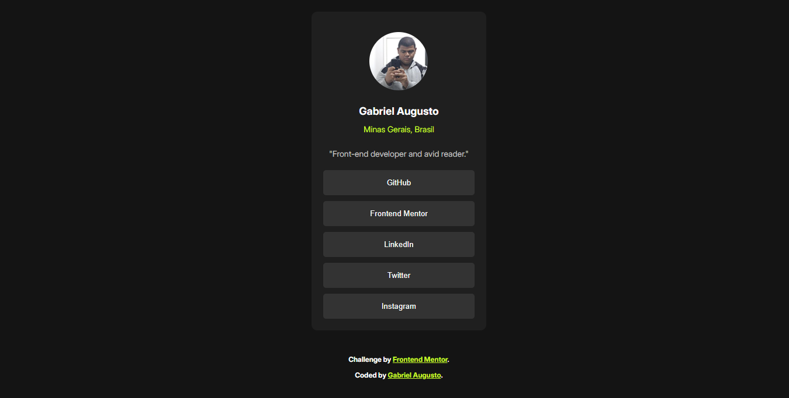

# Frontend Mentor - Social Links Profile Solution

This is a solution to the [Social links profile challenge on Frontend Mentor](https://www.frontendmentor.io/challenges/social-links-profile-UG32l9m6dQ). Frontend Mentor challenges help you improve your coding skills by building realistic projects.

## Table of contents

- [Overview](#overview)
  - [The challenge](#the-challenge)
  - [Screenshot](#screenshot)
  - [Links](#links)
- [My process](#my-process)
  - [Built with](#built-with)
  - [What I learned](#what-i-learned)
- [Author](#author)

## Overview

### The challenge

Users should be able to:

- View the social profile layout on any device (responsive)
- See hover and focus states for all interactive elements

### Screenshot



### Links

- Solution URL: [https://www.frontendmentor.io/solutions/social-links-profile-html-css-flexbox-e-media-queries-VBz475TCCk](https://www.frontendmentor.io/solutions/social-links-profile-html-css-flexbox-e-media-queries-VBz475TCCk)
- Live Site URL: [https://gabrielaugustober.github.io/Social-links-profile/](https://gabrielaugustober.github.io/Social-links-profile/)

## My process

### Built with

- Semantic HTML5
- CSS custom properties (variáveis)
- Flexbox
- Media Queries (responsividade)
- Mobile-first workflow

### What I learned

Neste projeto, reforcei meus conhecimentos em responsividade utilizando `flexbox` e `media queries`, além de boas práticas com variáveis CSS para manter uma paleta de cores consistente e facilitar a manutenção do código.

```css
:root {
  --color-green-100: hsl(75, 94%, 57%);
  --color-grey-900: hsl(0, 0%, 8%);
}
```

```html
<div class="card">
  <h1>Gabriel Augusto</h1>
</div>
```

## Author

- GitHub - [@GabrielAugustoBer](https://github.com/GabrielAugustoBer)
- Frontend Mentor - [@GabrielAugustoBer](https://www.frontendmentor.io/profile/GabrielAugustoBer)
